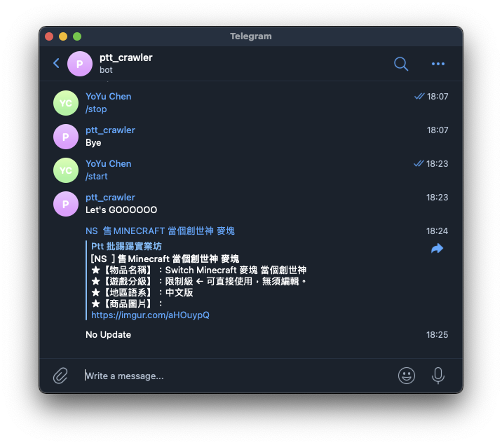

# PTT gamesale 爬蟲
買不到XBOX，只好爬看看有沒有二手貨

---

## 說明
透過 `node-schedule` 建立每分鐘的爬蟲，使用 `puppeteer` 建立模擬瀏覽器後到Gamesale版執行 `document.queryselector` 搜尋新頁面的文章標題，將符合的文章回傳紀錄後透過 `telegram bot` 傳給自己

---

## npm Dependency
[`puppeteer`](https://github.com/puppeteer/puppeteer)

[`node-schedule`](https://github.com/node-schedule/node-schedule#readme)

[`node-telegram-bot-api`](https://github.com/yagop/node-telegram-bot-api)

    npm init
    npm install
  
---

## Prepare
須先至 `telegram` 的 bot 管理機器人 *@BotFather* 申請建立新的機器人取得 `token`

建立與機器人的對話後，取得自己的 `chatid` 後將其設為環境變數：
    
    token="your_bot_token" 
    chatid="your_chat_id" 
    node telegramNotify.js
---

## Telegram start
啟動後在聊天室輸入 `/start` 就會開始收到訊息

若要停止追蹤則輸入 `/stop` 即會結束

---

## Result

